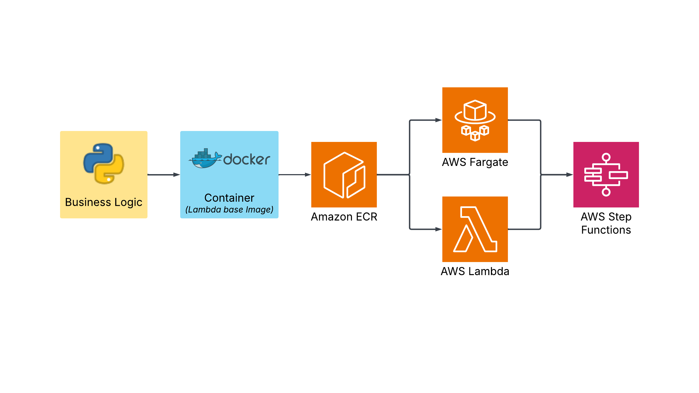

# aws-fargate-step-funtion-demo
Small repo that creates an AWS Step Function to call Fargate tasks.    

The end state of this demo is a Step Function that calls a Fargate Task. However we will 
build up to it by completing these steps:
1. Setup the environment
1. Create & publish container to ECR
1. Create a container that runs in Lambda
1. Create a Step Function that call this Lamdda multiple times
1. Create a Fargate Task that runs the same container
1. Create a Step Function that calls the Fargate Task

This simple repo replicates a much more complicated workflow that calls a process that is 
too large or runs too long (more than 5 mins) for Lambda. Using Lambda first is an 
excellent way to test the process in a reduced fashion before scalling up to the larger
process. This same methodology can be applied to much more complex business logic by 
simply changing the Docker image.

## 1. Setup the environment

### Configure the AWS Console
Before completing the following CLI command, you need to install the AWS CLI and configure 
it for the account, role and region you wish to use. I use the `aws configure sso` command.

### First set some environment variables
```shell
export AWS_ACCOUNT_ID=[ENTER YOUR AWS ACCOUNT ID HERE]
export BUCKET=[ENTER YOUR BUCKET NAME HERE]
export AWS_PROFILE=[ENTER YOUR CLI PROFILE NAME HERE]
export AWS_PAGER=""
export AWS_REGION=us-east-1
export IMAGE_NAME=timer
export IMAGE_TAG=v1
export LAMBDA_ROLE=lambda-execution
export STEP_ROLE=step-execution
export TASK_EXEC_ROLE=task-exec-role
export TASK_ROLE=task-role
```

### Create S3 bucket
This will be used to capture output from the Lambda and Fargate Tasks.
```shell
aws s3 mb s3://$BUCKET 
```

### Create Lambda Function Role
Both the Lambda and Step Function execution roles require a trust policy file that allowes
it to assume the associated service. These `*-trust-policy.json` files are in the root of
this repo.    

Create the Lambda role and attach the `AWSLambdaBasicExecutionRole`.
```shell
aws iam create-role --role-name $LAMBDA_ROLE \
--assume-role-policy-document file://lambda-trust-policy.json
aws iam attach-role-policy --role-name $LAMBDA_ROLE \
--policy-arn arn:aws:iam::aws:policy/service-role/AWSLambdaBasicExecutionRole
```
Attach an inline policy to write to the S3 bucket.
```shell
sed "s/BUCKET/${BUCKET}/" s3-write-policy.json > temp.json
aws iam put-role-policy --role-name $LAMBDA_ROLE \
--policy-name timer \
--policy-document file://temp.json
rm -f temp.json
```

### Create Step Function Role
Create the Step Function Role with the required truct policy.
```shell
aws iam create-role --role-name $STEP_ROLE \
--assume-role-policy-document file://step-trust-policy.json
```
Attached the required permissions by making a custom in-line policy.
```shell
sed "s/AWS_REGION/${AWS_REGION}/" step-role-policy.json > temp1.json
sed "s/AWS_ACCOUNT_ID/${AWS_ACCOUNT_ID}/" temp1.json > temp2.json
sed "s/IMAGE_NAME/${IMAGE_NAME}/" temp2.json > temp.json
aws iam put-role-policy --role-name $STEP_ROLE \
--policy-name timer \
--policy-document file://temp.json
rm -f temp*.json
```

### Create Task Execution Role
Create the ECS Task Execution Role with the required truct policy and excution policy.
```shell
aws iam create-role --role-name $TASK_EXEC_ROLE \
--assume-role-policy-document file://task-trust-policy.json
aws iam attach-role-policy --role-name $TASK_EXEC_ROLE \
--policy-arn arn:aws:iam::aws:policy/service-role/AmazonECSTaskExecutionRolePolicy
```
Allow the task execution role to create the log group if it doesn't exist.
```shell
sed "s/IMAGE_NAME/${IMAGE_NAME}/" task-exec-policy.json > temp1.json
sed "s/AWS_REGION/${AWS_REGION}/" temp1.json > temp2.json
sed "s/AWS_ACCOUNT_ID/${AWS_ACCOUNT_ID}/" temp2.json > temp.json
aws iam put-role-policy --role-name $TASK_EXEC_ROLE \
--policy-name timer --policy-document file://temp.json
rm -f temp*.json
```

### Create the Task Role
See a description of the difference between ECS `Task Execution` and `Task` roles 
[here](https://towardsthecloud.com/amazon-ecs-task-role-vs-execution-role).   
```shell
aws iam create-role --role-name $TASK_ROLE \
--assume-role-policy-document file://task-trust-policy.json
```
Attach an inline policy to write to the S3 bucket.
```shell
sed "s/BUCKET/${BUCKET}/" s3-write-policy.json > temp.json
aws iam put-role-policy --role-name $TASK_ROLE \
--policy-name timer --policy-document file://temp.json
rm -f temp.json
```

## 2. Create and Publish Container to ECR

### Commands to build image and verifiy that it was built
```shell
docker buildx build --platform linux/amd64 --provenance=false -t ${IMAGE_NAME}:$IMAGE_TAG .
docker images 
```

#### Note
If trying to build mulitple times you may run out of disk space.   
`docker system df` will show the reclaimable disck space.   
`docker system prune -a` will delete all docker artifacts.   

### Authenticate Docker CLI with ECR
You should see `Login Succeeded` after this command.
```shell
aws ecr get-login-password --region $AWS_REGION | docker login --username AWS \
--password-stdin $AWS_ACCOUNT_ID.dkr.ecr.$AWS_REGION.amazonaws.com
```

### Create an ECR repository
Note you only have to do this once. You may also simply use an existing repo.
```shell
aws ecr create-repository --repository-name $IMAGE_NAME --region $AWS_REGION \
--image-scanning-configuration scanOnPush=true --image-tag-mutability MUTABLE
```

### Give the image the `latest` tag
```shell
docker tag ${IMAGE_NAME}:${IMAGE_TAG} $AWS_ACCOUNT_ID.dkr.ecr.$AWS_REGION.amazonaws.com/${IMAGE_NAME}:latest
```

### Deploy Docker image to ECR
```shell 
docker push $AWS_ACCOUNT_ID.dkr.ecr.$AWS_REGION.amazonaws.com/${IMAGE_NAME}:latest
```

## 3. Create the Lambda
### Create the actual Lambda function
```shell
aws lambda create-function \
--function-name $IMAGE_NAME --package-type Image \
--code ImageUri=$AWS_ACCOUNT_ID.dkr.ecr.$AWS_REGION.amazonaws.com/${IMAGE_NAME}:latest \
--role arn:aws:iam::${AWS_ACCOUNT_ID}:role/$LAMBDA_ROLE
```

### Change the timeout
```shell
aws lambda update-function-configuration --function-name $IMAGE_NAME --timeout 120
```

### Test the function
```shell
aws lambda invoke --function-name $IMAGE_NAME \
--payload '{"job_id": 1, "duration": 5, "bucket": "'${BUCKET}'"}' \
--cli-binary-format raw-in-base64-out response.json
```

### Update the function
```shell
aws lambda update-function-code --function-name $IMAGE_NAME \
--image-uri $AWS_ACCOUNT_ID.dkr.ecr.$AWS_REGION.amazonaws.com/${IMAGE_NAME}:latest \
--publish
```

## 4. Create the Lambda Step Function
```shell
sed "s/AWS_REGION/${AWS_REGION}/" step-lambda-definition.json > temp1.json
sed "s/AWS_ACCOUNT_ID/${AWS_ACCOUNT_ID}/" temp1.json > temp2.json
sed "s/IMAGE_NAME/${IMAGE_NAME}/" temp2.json > temp.json
aws stepfunctions create-state-machine --name ${IMAGE_NAME}-lambda \
--definition "$(cat temp.json)" \
--role-arn arn:aws:iam::${AWS_ACCOUNT_ID}:role/$STEP_ROLE
rm -f temp*.json
```

### Invoke the step function
The following command invokes the step function.
```shell
sed "s/BUCKET/${BUCKET}/" step-input-lambda.json > temp.json
aws stepfunctions start-execution \
--state-machine-arn arn:aws:states:${AWS_REGION}:${AWS_ACCOUNT_ID}:stateMachine:${IMAGE_NAME}-lambda \
--input "$(cat temp.json)"
rm -f temp.json
```

The following commands investigates the results sent to S3.
```shell
aws s3 cp s3://${BUCKET}/test-1.json .
aws s3 cp s3://${BUCKET}/test-2.json .
cat test-1.json
cat test-2.json
```

## 5. Create Fargate Task to Run Timer Container

### Create the ECS Cluster
```shell
aws ecs create-cluster --cluster-name $IMAGE_NAME
```

### Create the ECS Task Definition
```shell
sed "s/IMAGE_NAME/${IMAGE_NAME}/;s/BUCKET/${BUCKET}/" task-definition.json > temp1.json
sed "s/AWS_REGION/${AWS_REGION}/;s/AWS_ACCOUNT_ID/${AWS_ACCOUNT_ID}/" temp1.json > temp2.json
sed "s/TASK_ROLE/${TASK_ROLE}/;s/TASK_EXEC_ROLE/${TASK_EXEC_ROLE}/" temp2.json > temp.json
aws ecs register-task-definition --cli-input-json file://temp.json
rm -f temp*.json
```

### Run the ECS Task
Before running a task you must determine you VPC subnets and security groups and set the 
appropriate environment variables.
```shell
export SUBNETS=[ENTER YOUR SUBNETS SEPARATED WITH A ,]
export SECURITY_GROUP=[ENTER YOUR SECURITY GROUP]
```
Note the single and double quotes in the example below.
```shell
export SUBNETS='"subnet-1","subnet-2"'
export SECURITY_GROUP=sg-1
```

```shell
sed "s/SECURITY_GROUP/${SECURITY_GROUP}/;s/SUBNETS/${SUBNETS}/" network-configuration-cli.json > temp.json
aws ecs run-task --cluster $IMAGE_NAME --task-definition $IMAGE_NAME \
--launch-type "FARGATE" --network-configuration file://temp.json \
--overrides '{ "containerOverrides": [{"name": "'$IMAGE_NAME'", "command": ["app.py", "--job_id", "2", "--duration", "2", "--bucket", "'$BUCKET'"]}]}'
rm temp.json
```
The following CLI commands may help list the available subnets and security groups. You 
can also filter by VPC.
```shell
aws ec2 describe-subnets --query "Subnets[*].SubnetId"
aws ec2 describe-security-groups --query "SecurityGroups[*].[GroupId]"
```

## 6. Create the Fargate Step Function
```shell
sed "s/AWS_REGION/${AWS_REGION}/" step-fargate-definition.json > temp1.json
sed "s/AWS_ACCOUNT_ID/${AWS_ACCOUNT_ID}/" temp1.json > temp2.json
sed "s/IMAGE_NAME/${IMAGE_NAME}/" temp2.json > temp3.json
sed "s/SECURITY_GROUP/${SECURITY_GROUP}/;s/SUBNETS/${SUBNETS}/" temp3.json > temp.json
aws stepfunctions create-state-machine --name ${IMAGE_NAME}-fargate \
--definition "$(cat temp.json)" \
--role-arn arn:aws:iam::${AWS_ACCOUNT_ID}:role/$STEP_ROLE
rm -f temp*.json
```

### Invoke the step function
```shell
sed "s/BUCKET/${BUCKET}/" step-input-fargate.json > temp.json
aws stepfunctions start-execution \
--state-machine-arn arn:aws:states:${AWS_REGION}:${AWS_ACCOUNT_ID}:stateMachine:${IMAGE_NAME}-fargate \
--input "$(cat temp.json)"
rm -f temp.json
```

## References
- [AWS CLI - Installation](https://docs.aws.amazon.com/cli/latest/userguide/install-cliv2-linux.html)
- [AWS CLI - Add permissions](https://awscli.amazonaws.com/v2/documentation/api/latest/reference/lambda/add-permission.html)
- [AWS CLI - Invoke Lambda](https://docs.aws.amazon.com/cli/latest/reference/lambda/invoke.html#examples)
- [AWS Step Output Filter](https://docs.aws.amazon.com/step-functions/latest/dg/input-output-example.html)
- [AWS Lambda Runtimes](https://docs.aws.amazon.com/lambda/latest/dg/lambda-runtimes.html)
- [AWS Container Lambda](https://docs.aws.amazon.com/lambda/latest/dg/images-create.html)   
- [AWS Python Container Lambda](https://docs.aws.amazon.com/lambda/latest/dg/python-image.html)    
- [ECS Task vs Task Execution Role](https://towardsthecloud.com/amazon-ecs-task-role-vs-execution-role)    
- [AWS ECS Task Definition Parameters](https://docs.aws.amazon.com/AmazonECS/latest/developerguide/task_definition_parameters.html)    
- [AWS Example ECS Task Definitions](https://docs.aws.amazon.com/AmazonECS/latest/developerguide/example_task_definitions.html)    
- [AWS Create ECS Task with CLI](https://docs.aws.amazon.com/AmazonECS/latest/developerguide/ECS_AWSCLI_Fargate.html)    
- [AWS Fargate with Step Functions](https://docs.aws.amazon.com/step-functions/latest/dg/connect-ecs.html)    
